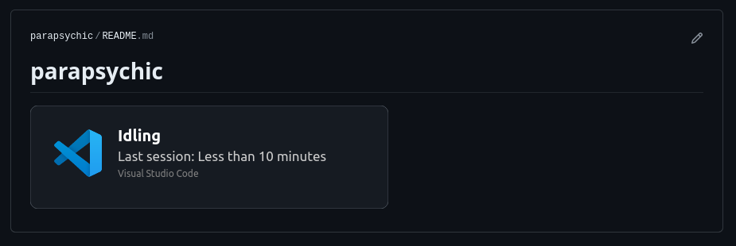

# IShowOff for Visual Studio Code Extension

The companion extension for [IShowOff](https://github.com/parapsychic/ishowoff).

This extension can automatically run the Github Action display your session time on your Github profile like this:

## Setup

1. Get a [Personal Access Token](https://github.com/settings/tokens/new). Please keep in mind that this token is equivalent to your password. Do not give it admin permissions. repo:write permissions are required. Anything below that is not required. Also, for extra safety, set an expiration date.
2. Fork [IShowOff](https://github.com/parapsychic/ishowoff) and follow the instructions on that repo.
3. Set the settings in VS Code. You should be prompted during the first run. Be sure to set the **Token** from last step, **username**, **forked repo name** from last step (usually, just ishowoff).

## Custom Commands
If you want to supply additional arguments or run different commands after running the rust binary to create svg file, you can use the custom commands section.

View full list of [arguments here](https://github.com/parapsychic/ishowoff). Some of them are set by the other setting fields and might get overwritten.

To run a entirely different command, use the [chaining operators](https://www.geeksforgeeks.org/chaining-commands-in-linux/) in Bash, assuming you did not change the actions to run on a different operating system.

## Known issues:
1. Editing config might trigger multiple timers and may send multiple rerun requests to github workflow. I'm working on a fix. (fixed ig?)
2. Opening different VSCode winddows/instances will trigger different timers and will keep on overwriting by calling the action on specified intervals. This is intended behaviour and can be stopped by calling ishowoff.disablePresence from the command palette on one of the instances.
3. You tell me. Open an issue.

**Enjoy**
